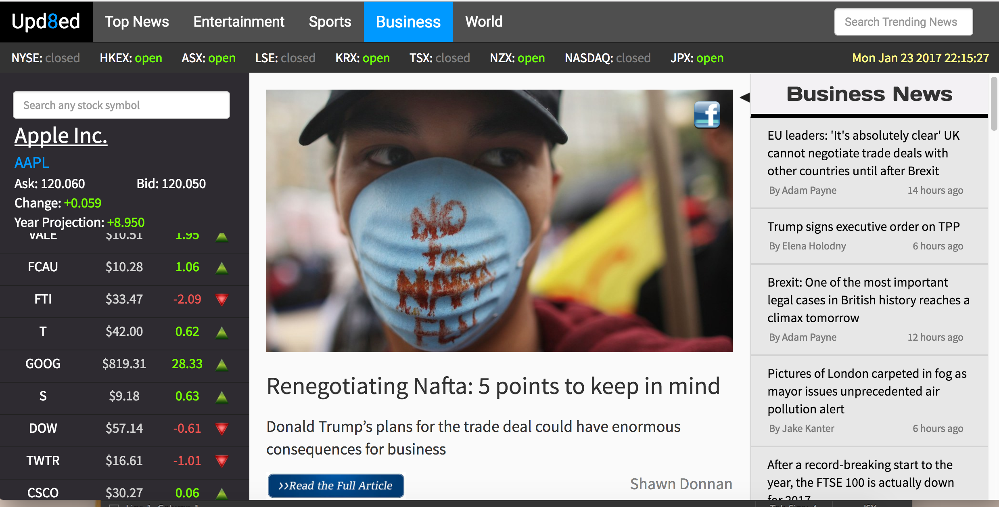
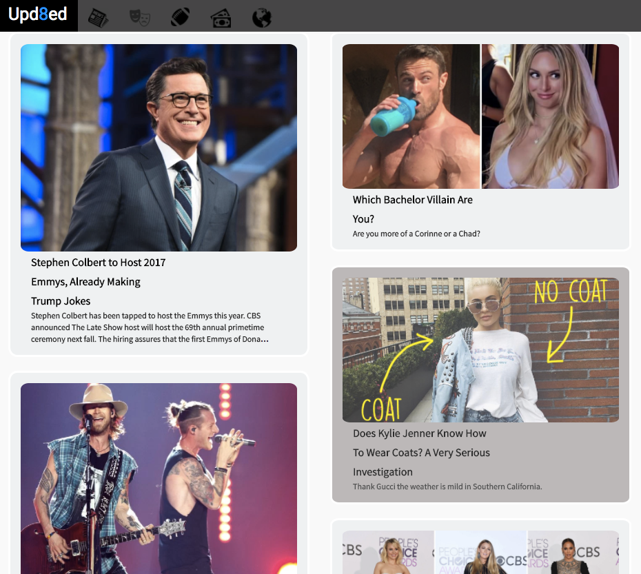
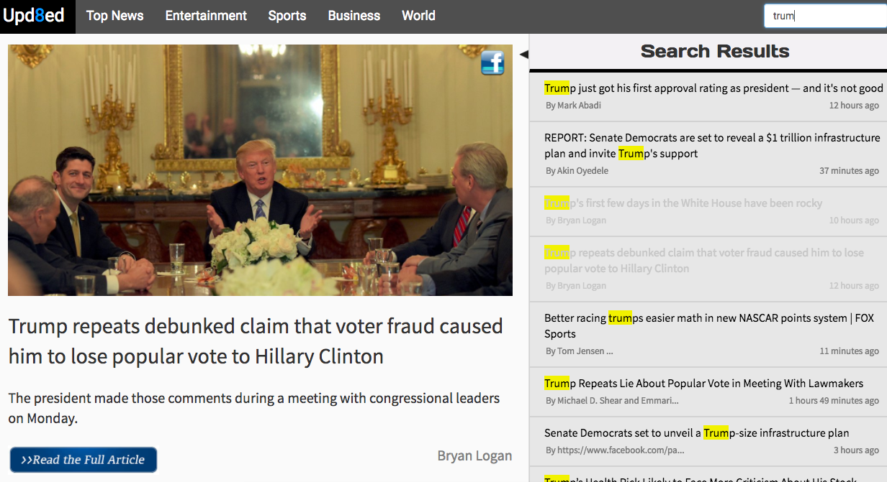
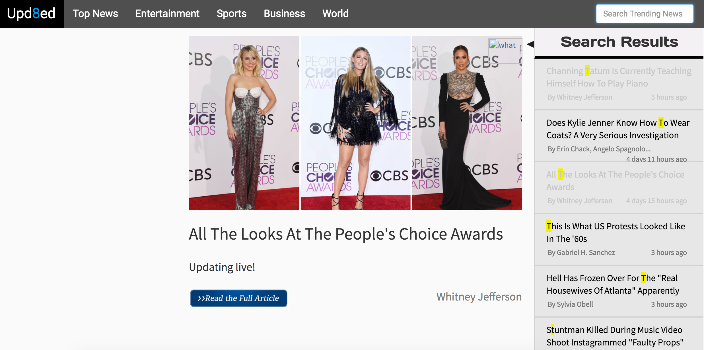
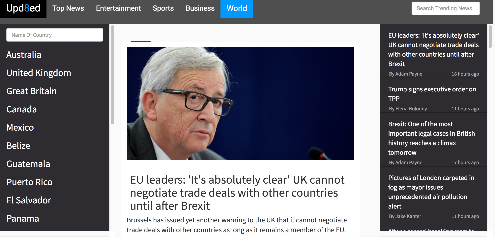
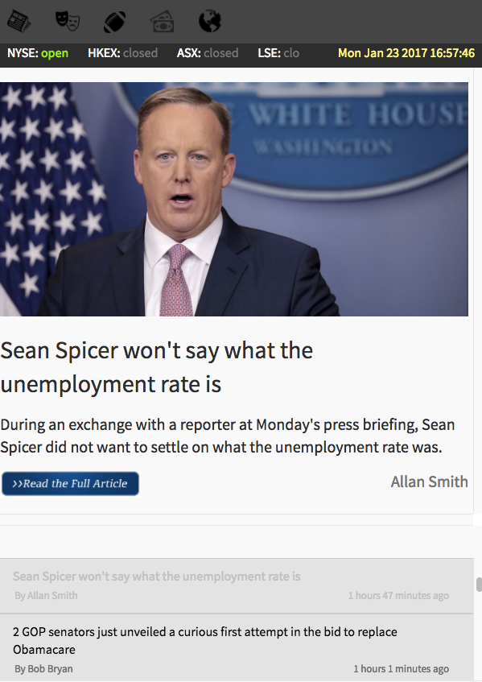
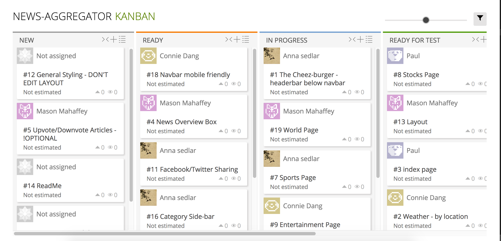

# Upd8ed: Aggregated. Upd8ed.

# The MSON Objects

## Description/Overview
Upd8ed, a news aggregator, is a demonstration of the front-end skills we have learned during our time thus far in coding bootcamp. We have created a one-stop shop by pulling the latest business, entertainment, global, sports news from a variety of sources for the viewer. Upd8ed replicates the functionality of google news with the influence of Reddit.com and Pinterest.com.

[Live URL](https://www.pauldkang.com/news)

## Table of contents

[Description/Overview](#description/overview)

[Technologies Used](#technologies)

[Challenges and Solutions](#challenges-and-solutions)

[GitHub Link](#github-link)

[Code Snippets and Screenshots](#code-snippets-and-screenshots)

[MVP](#mvp-minimal-viable-product)

[Stretch Goals](#stretch-goals)

[Team Members and Contributions](#team-members-and-contributions)

[Project Timeline](#project-timeline)


## Technologies
The following languages, frameworks and APIs were used:

  * HTML

  * CSS

  * Javascript

  * Bootstrap

  * React.JS

  * node.JS

  * News API

  * OpenWeatherMap API

  * Yahoo Finance API


## Challenges and Solutions
1.  **Challenge:** Organizing styling and layout when working with ReactDOM, bootstrap, and original CSS. Certain layouts conflicted with how we wanted to style each page using Bootstrap. 

   **Solution:** This was an issue throughout the entire project. We developed unique solutions for each page depending on what best fit it. With the entertainment page, the code was rewritten to allow for easier styling and reduce unecessary white space. 

2. **Challenge:** Search page that allows us to sort through the results. 
The news api we were using did not have a keyword property in each of their articles. We had 60 news sources, each giving us their current top 10 articles, so we awere able to pull 600+ different articles, but without a way to sort through them.

  **Solution:**
First we made a global array of all the news sources (60 items), Then we made the ajax calls for each source and added all 600 articles into an array saved in the state of the parent component. The array of articles are then passed to the child component as props, where we built a quick sorting algorithm. From the input box component, we got the user input value and passed it up to its parent where routing happens. As input changes we went to a new route with the input value as the parameter. This input value is then passed all the way down to the child component which contains all the articles. Next, we looped through the titles of the articles looking for matches with whatever words user typed in. Those articles are rendered on the right. At onClick of each article, the article data is sent to the parent component through a parameter in a function, and sent back down to a description component where it displays the image, link to full article, etc.

3. **Challenge:** We wanted to make the entertainment page visually appealing while remaining mobile-friendly at the same time. Originally, the code was written so that all articles were placed into four divs depending on their source. Because differnet sources pulled different amounts of articles, there were some glaring blank spaces at the end of the page for the sources that pulled the least amount of articles. This became especially true when the page was resized to mimic a mobile device. 

   **Solution:** The code was condensed and rewritten for styling purposes. By putting all the articles and their pieces into an array and dividing them up into four divs, we were able to present the same number of articles per div regardless of the number of articles each source pulled in. Additionally, we also put a maximum length on the description of the article. Visually, the number of gaps minimized and were replaced by articles from other news sources. This allowed for easier bootstrap styling.

4. **Challenge:** Slider for sports page. The React Slider component the sports page was cloned from github user akiran. Because of it's pre-written rules, styling it according to our data needs proved very difficult. There were customizable settings, none of which gave us the usability required. Teasing out an effective fix was a hack job with CSS classes that took time, but ultimately we succeeded.

   **Solution:** The React Slider component the sports page was cloned from github user akiran. Because of it's pre-written rules, styling it according to our data needs proved very difficult. There were customizable settings, none of which gave us the usability required. Teasing out an effective fix was a hack job that took time, but ultimately we succeeded by targeting hidden CSS classes and overwriting their value using '!important'. It's not pretty, but it works


## GitHub Link
[Upd8ed](https://github.com/mason0958/News-Aggregator)

## Code Snippets and Screenshots

Although not necessarily apparent in this screenshot, the stocks on the left side of the page are constantly being updated. Notice also that header below the nav bar displays up to date information on whether a stock market is currently open as well as the local time. 



This is accomplished by the code below:

```js

var symbol = 'BAC+FB+TSLA+WPX+WFC+RAD+FCX+AAPL+F+GE+JCP+JPM+VALE+FCAU+FTI+T+GOOG+S+DOW+TWTR+CSCO+INTC+QQQ+MU+XIV+NVDA+NFLX+JNJ+HBAN+ARRY+CMCSA+TVIX+GRPN+ARIA+MSFT+SIRI'
var stockFront = 'http://query.yahooapis.com/v1/public/yql?q=select%20*%20from%20yahoo.finance.quotes%20where%20symbol%20in%20("'
var stockTail = '")%0A%09%09&env=http%3A%2F%2Fdatatables.org%2Falltables.env&format=json'
var stockUrl = stockFront + symbol + stockTail

//parent of Stock.js, StockSearch.js, StockMarkets.js
class Stocks extends Component {
    constructor(props) {
      super(props);
      this.state = {stocks: []};
      this.componentDidMount = this.componentDidMount.bind(this);
  };
    componentDidMount() {
    $.getJSON(stockUrl, (stockData) =>{
      var stockArr = stockData.query.results.quote
      var stockArrMin = []
      for(let i = 0; i < stockArr.length; i++){
        if(stockArr[i].symbol!==null){
          if(stockArr[i].DaysHigh==null){stockArr[i].DaysHigh = "-"};
          if(stockArr[i].Change==null){stockArr[i].Change = "0"};
          // changed stock.Change to yearly change for display on weekends
          var eachStock = {
            symbol: stockArr[i].symbol,
            price: stockArr[i].LastTradePriceOnly,
            change: stockArr[i].ChangeFromFiftydayMovingAverage,
            name: stockArr[i].Name
          }
          stockArrMin.push(eachStock)
        }
      }
      this.setState({stocks: stockArrMin})
    });   
    }

    render() {
      //left column hidden in phone
      if(this.state.stocks.length > 4){
        return(
          <div>
          <StockHeader />
          <div className='hidden-sm hidden-xs'>
              <StockSearch />
              <Stock stocks={this.state.stocks} />
            </div>
          </div>
      )
    }else{
      return(
        <div>
          <StockHeader />
          <div className='blinkingLetters' style={{marginTop:35,fontSize: 30,position:'fixed',marginLeft:10}}>Loading Stocks...</div>
        </div>
      )
    }
    }
}


export default Stocks;
```

For visual appeal, we put the top ESPN news in a slider and displayed the entertainment articles in a Pinterest-inspired layout. We used [Kiran's](https://github.com/akiran) open-source slider.

```js
import SportsHome from './SportsHome';
import giveToSliderPhoto from './SportsHome';
var React = require('react');
var Slider = require('react-slick');


var SimpleSlider = React.createClass({
 render: function () {
   var settings = {
     dots: true,
     speed: 500,
     slidesToShow: 1,
     slidesToScroll: 1,
     autoplay: true,
     autoplaySpeed: 4000,
     adaptiveHeight: true,
     arrows: false,
     pauseOnHover: true,
     useCSS: true,
     centerMode: true,
     variableWidth: true
 
   };

   // console.log(this.props.articles)
   var imgURL = []
        {this.props.articles.map(function(article, index){
         imgURL.push(<div className="anna" key={index}><a target="_blank" href={article.url}>
                       </a></div>)}
       )}
   var titles = []
     {this.props.articles.map(function(article, index){
       titles.push(<div className="row slider_titles" key={index}><a target="_blank" href={article.url}>{article.title}</a></div>)
     })}

   return (
     
     <div className="slider">
       <Slider{...settings}>
         <div>
           <div >{imgURL[0]}</div>
           <div>{titles[0]}</div>
         </div>
         <div>
           <div>{imgURL[1]}</div>
           <div>{titles[1]}</div>
         </div>
         <div>
           <div>{imgURL[2]}</div>
           <div>{titles[2]}</div>
         </div>
         <div>
           <div>{imgURL[3]}</div>
           <div>{titles[3]}</div>
         </div>
         <div>
           <div>{imgURL[4]}</div>
           <div>{titles[4]}</div>
         </div>
       </Slider>
     </div>
   );
 }
});

export default SimpleSlider;
```

Entertainment page in tablet view. Notice how the icons in the links in the navbar have now changed to symbols when the size of the device has been reduced.



Want to search for specific articles anywhere on the site? Simply start typing in the search box. The articles retrieved from your query will have the word highlighted in its title. We tried searching "Trump" in the wake of the 2017 inauguration. Pretty neat!



What if you can't remember if you've read this particular article before? No worries. Once you click on an article it turns gray as demonstrated in the first three articles. There is also an option to share this article on your Facebook account.



Here is where it all happens:

```js
var readColor = 'black'
    var authorColor = 'grey'
    var keyWordColor = 'black'
    var keyBg = 'yellow'
    if(this.state.read === 'seen'){readColor='lightgrey'; authorColor='lightgrey'; keyWordColor='lightgrey'; keyBg='none'}

    return(
      <div className='click-article' onClick={this.childOnClick} style={{color:readColor, padding:'10px 20px', borderLeft:'1px solid #ddd',borderBottom:'2px solid #ddd'}}>
        <div style={{fontSize:16}}>
          <div>{this.props.frontText}
            <span style={{backgroundColor:keyBg, color:keyWordColor}}>{this.props.highlightText}</span>
            {this.props.backText}
          </div>
        </div>
        <div style={{marginLeft:2, marginTop:5, fontSize:13, color:authorColor}}>
          <div style={{float:'left'}}>{authorText}</div>
          <div style={{float:'right', marginRight:10}}>{publishText}</div>
        </div>
        <br/>
      </div>
    )
  }
}
```

This is the specific line that tells us how we mark articles as "read":

`if(this.state.read === 'seen'){readColor='lightgrey'; authorColor='lightgrey'; keyWordColor='lightgrey'; keyBg='none'}`

The layout of the world page is what we strived for in most of our pages. The 3-column layout includes a larger view of a selected article sandwiched between a region selector and a search bar.



And just to make sure our website is mobile-friendly, we tested each page by shrinking our view. This is what the Business page looks like on a mobile device. As with the entertainment page, notice how the links in the navbar have been changed to icons on smaller views.



## MVP (Minimal Viable Product)
**Top news page:** displaying the current weather and a few top news articles from each page (entertainment, sports, business and world)

**Entertainment page:** displaying the latest articles from Entertainment-Weekly, Buzzfeed, MTV, MTV-UK and Daily Mail

**Sports news:** displaying the latest articles from talkSPORT, ESPN and FOX sports.

**Business page:** displaying the latest articles from Business Insider, Financial Times, Business Insider UK, Fortune' and The Economist

**World:** displaying the latest top articles from each continent

## Stretch Goals
1. Upvote/downvote option for users
2. Option to share articles on social media
3. Backend server
4. Displaying articles in an Iframe modal

## Team Members and Contributions
All team members are full stack web development students of the [DigitalCrafts](http://www.digitalcrafts.com/) November 2016 cohort. This project utilizes our frontend skills that we have learned along with pair programming and SCRUM agile development methodology. We used Taiga to implement a Kanban task scheduling system to practice agile software development. 




* [Paul Kang](https://github.com/pdwkang) 

**Role:** Dungeon Master - Data wizard - MVP

**Contributions:** Led team to timely completion of project. Built layout of website from scratch with Mason. Designed the top news and business pages to incorporate a continuously updating stocks page. Implemented a dynamic search bar that highlights user inputs and marks "read" articles. Created a mobile-friendly version of Upd8ed utilizing icons in the nav bar when viewing size is reduced. Provided a sharing link to Facebook for all articles. Flawless backup styling throughout website. Updated task cards on Taiga to reflect project progress. Resolved coding challenges team members faced throughout the project. Conceptualized logo.

* [Mason Mahaffey](https://github.com/mason0958) 

**Role:** THE MSON.object idea genius 

**Contributions:** World news page along with region-specific articles. Developed initial project concept with Paul. Outlined with detail the project from beginning to completion. Set up a Taiga account for the group to manage the development process and document issues. Assigned tasks for each team member based on their strengths. Suggestion for features to add. Backend consultant. 

* [Anna Sedlar](https://github.com/annasedlar) 

**Role:** Packers gurl - Sports Data Analyst  

**Contributions:** Created and styled the sports page. Populated sports page with content by working with the external API. Displayed articles in an organized manner and used a slider to display the top 5 articles from a single source, with focus on visual appeal. Updated task cards on Taiga to reflect progress of project. Pitched ideas to style navbar. 

* [Connie Dang](https://github.com/dangconnie) 

**Role:** Wordsmith - Mediator - Task Manager

**Contributions:** Functioning weather widget that takes user input to display the latest weather based on location. Pinterest-inspired entertainment page dsplaying the latest articles from each source as extracted from the API. Planned, wrote and revised README file to incorporate code changes. Developed all-encompassing slogan. Incorporated feedback and made adjustments to design of page. 

**I want to help out!**

* If you would like to report an issue with our code or a suggest a way to improve it, simply contact one of us. We are always looking for ways to improve!* 

If you would like to contribute to our project, we are looking to add the the following:

1. Add categories to include technology, health, nearby events and local news

2. Add more to sports page to include scores, schedules and stats

3. Improve UI/UX (hover effects on articles where appropriate, better CSS styling)


## Project Timeline
* Project start: 1/18/2017

* Project completion: 1/24/2017